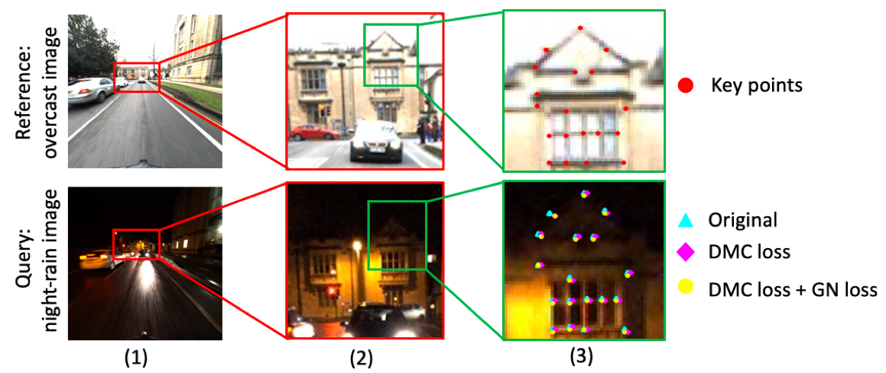

## Leveraging Pixel Correspondences for Sparse-to-Dense Feature-Metric Localization

### 1 Description:
Visual localization is a key component to many robotics systems. 
However, it is very challenging in changing conditions such as day-night or summer-winter. 
Based on Sparse-to-Dense Hypercolumn Matching, we improve the localization accuracy by 
(1) performing Feature-metric PnP given an initial estimation of the pose %together with dense deep features of images and 
(2) training on the supervision of pixel correspondences using double margin contrastive loss and Gauss-Newton loss to generate better feature maps. 
Experimental results show that Feature-metric PnP refines pose estimation and we achieve our best accuracy when combine it with features trained on correspondences. **This repository is training code of the whole visual localization pipeline. You can find the evaluation part [here](https://github.com/zimengjiang/S2DHM/tree/vgg).**



### 2 Data root
You can download the dataset [here](https://www.visuallocalization.net/datasets/). You need to follow directory structure of the `data` as below.
```
${gn_net root}
├── data
├── ├── robotcar
|   `── ├── correspondence/
|       |   ├── *.mat
|       ├── images
│           ├── overcast-reference/
│           ├── overcast-summer/
│           ├── overcast-winter/
│           ├── sun/
│           ├── dawn/
│           ├── rain/
│           ├── snow/
│           ├── dusk/
│           ├── night/
│           └── night-rain/
├── ├── cmu
|   `── ├── correspondence/
|       |   ├── *.mat
|       ├── images
│           ├── slice6/
│           ├── slice7/
│           ├── slice8/
            ...
```

### 3 Getting Started:

Run the following commands to install this repository and the required dependencies:

```bash
git clone https://github.com/zimengjiang/gn_net.git
cd gn_net/
pip3 install -r requirements.txt
```
This code was run and tested on Python 3.7.3, using Pytorch 1.5.1 although it should be compatible with some previous versions. You can follow instructions to install Pytorch [here](https://pytorch.org/). *Please configure the data root and save root before training! You can change the parameters in **run.py**.*
The **vgg_checkpoint** is the original weight provided by S2DHM. You can download the checkpoint files from [here](https://github.com/germain-hug/S2DHM/tree/master/checkpoints). And please remember to set up the path to **vgg_checkpoint** in **run.py**.


```
python run.py
```

### 4 Pipeline:
The whole pipeline consists of this repository and the [S2DHM with Feature-PnP](https://github.com/zimengjiang/S2DHM/tree/vgg).


### 5 Evaluation:
You can evaluate the checkpoint files using the [S2DHM with Feature-PnP](https://github.com/zimengjiang/S2DHM/tree/vgg).

### 6 Code references:
Part of this repository is based on the official S2DHM and UNET repositories.
* [S2DHM](https://github.com/germain-hug/S2DHM)
* [UNET](https://github.com/milesial/Pytorch-UNet)
